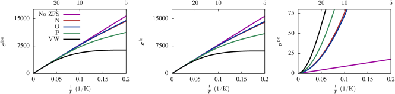

# pNMR Shift Program

## Description

Uses calculated data for a molecular open-shell system and assembled the paramagnetic contributions to a NMR chemical shift (pNMR) tensor and the corresponding isotropic chemical shift.

## Authors & Credits

(c) 2013-2016 Benjamin Pritchard, Bob Martin and Jochen Autschbach

If you use or modify this software, please acknowledge this work by citing the following research publications:

Martin, B.; Autschbach, J., Kohn-Sham Calculations of NMR shifts for paramagnetic 3d metal complexes: Protocols, impact of the delocalization error, and analysis of the curious amide proton shifts of a high-spin iron(II) macrocycle complex, Phys. Chem. Chem. Phys. 2016, 18, 21051–21068. 
URL https://doi.org/10.1039/C5CP076

Martin, B.; Autschbach, J., Temperature dependence of contact and dipolar NMR chemical shifts in paramagnetic molecules, J. Chem. Phys. 2015, 142, 054108. 
URL https://doi.org/10.1063/1.4906

Autschbach, J.; Patchkovskii, S.; Pritchard, B., Calculation of hyperfine tensors and paramagnetic NMR shifts using the relativistic zeroth-order regular approximation and density functional theory, J. Chem. Theory Comput. 2011, 7, 2175–2188. 
URL https://doi.org/10.1021/ct200143w

## How to build

Requirements:
A C++ Compiler
A Fortran Compiler
CMake >= 2.8

To build, use cmake:

    # from the top-level directory of the pnmr-shift repo:
    mkdir build
    cd build
    cmake ../
    make

The PNMRShift binary is located in the build directory you just created
and is statically linked. It can then be copied to wherever you'd like (`~/bin`
, etc).

## Examples

The package includes an example of the calculation with triplet O2,
and an example for triplet Nickelocene (NiCp2). 
For further details please see the README files in the example directories.

## Manual

There is a detailed manual in `latex-doc'
